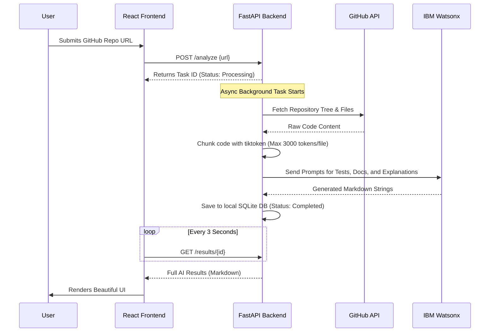

# 🤖 BOBCAT 

[](#)
[](#)
[](#)
[](#)

> **AutoDocTest AI** is an intelligent developer tool that automatically analyzes public GitHub repositories and generates comprehensive Unit Tests, structured API Documentation, and deep Code Explanations using the power of IBM Watsonx.

---

## ✨ Features

- **🧠 Powered by IBM Watsonx:** Utilizes the advanced `ibm/granite-8b-code-instruct` model specifically tuned for coding tasks.
- **⚡ One-Click Analysis:** Simply paste a GitHub repository URL, and the AI will scan the file structure and read the code.
- **🚀 Asynchronous Processing:** A non-blocking FastAPI backend using BackgroundTasks ensures even large repositories don't time out the browser.
- **📝 Markdown Rendering:** The React frontend beautifully renders the raw Markdown and code blocks returned by the AI.
- **🧩 Smart Chunking:** Intelligently chunks large codebases using `tiktoken` to respect the AI's context window limits without losing critical logic.

---

## 🏗️ Architecture Flow



---

## 🚀 Getting Started

### Prerequisites
- Node.js (v18+)
- Python 3.9+
- An IBM Cloud Account with Watsonx.ai access
- A GitHub Personal Access Token (for increased API rate limits)

### 1. Backend Setup (FastAPI)

1. Navigate to the backend directory:
   ```bash
   cd backend
   ```
2. Create and activate a virtual environment (optional but recommended):
   ```bash
   python -m venv venv
   source venv/bin/activate  # On Windows: venv\Scripts\activate
   ```
3. Install dependencies:
   ```bash
   pip install -r requirements.txt
   ```
4. Set up your Environment Variables:
   Create a `.env` file in the `backend/` directory with the following keys:
   ```env
   GITHUB_TOKEN=your_github_personal_access_token
   WATSONX_API_KEY=your_watsonx_api_key
   WATSONX_PROJECT_ID=your_watsonx_project_id
   WATSONX_URL=https://us-south.ml.cloud.ibm.com
   ```
5. Run the server:
   ```bash
   uvicorn main:app --reload
   ```
   *The backend will be available at `http://127.0.0.1:8000`*

### 2. Frontend Setup (React + Vite)

1. Open a new terminal window and navigate to the project root:
   ```bash
   cd BOB-HACKATHON
   ```
2. Install Node dependencies:
   ```bash
   npm install
   ```
3. Start the development server:
   ```bash
   npm run dev
   ```
4. Open your browser to `http://localhost:5173`.

---

## 🔮 Future Goals & Roadmap

1. **Direct GitHub PR Integration:** Instead of just displaying the code, the app will automatically open a Pull Request (PR) on the user's repository, injecting the new tests and `README.md` updates directly into their codebase.
2. **Private Repository Support:** Implement GitHub OAuth so companies can securely analyze their proprietary, private codebases.
3. **CI/CD Pipeline Plugin:** Build a GitHub Action so the AI runs automatically on every single commit, ensuring documentation and tests never fall out of date.
4. **Interactive "Chat with your Repo":** Add a conversational UI where developers can chat with IBM Watsonx to ask specific architectural questions.

---
*Built with ❤️ for the IBM BOB Hackathon*
